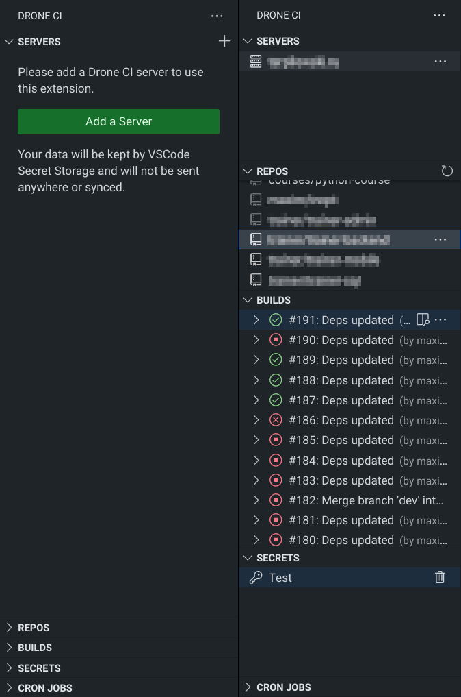

# Drone CI Extension for Visual Studio Code

This extension integrates Drone CI into VS Code. It allows you to quickly browse and manage your repos, builds, secrets
and cron jobs.

## Features

* *Multi-server support for Drone CI*: enhance your workflow with support for multiple Drone CI servers.
* *Effortless repository and build management*: seamlessly manage repositories, builds, secrets, and cron jobs; easily perform actions like adding, editing, deleting, updating, or promoting your builds to any target.
* *Detailed build information and step logs*: access comprehensive build information and step logs.
* *Convenient access to server and repository pages*: quickly navigate to your server and repository pages with direct links.

## Installation

This extension is available on the [Visual Studio Marketplace](https://marketplace.visualstudio.com/items?itemName=maximtrp.drone-ci) for Visual Studio Code and [Open VSX Registry](https://open-vsx.org/extension/maximtrp/drone-ci).

## Donate

If you find this extension useful, please consider donating any amount of money. This will help me spend more time on supporting open-source software.

## Copyright

[Drone CI](https://www.drone.io/) [icon and logo](resources/) by [Harness Inc.](https://www.harness.io/) are licensed under [CC BY-NC-ND 4.0](https://github.com/drone/brand/blob/master/LICENSE).
